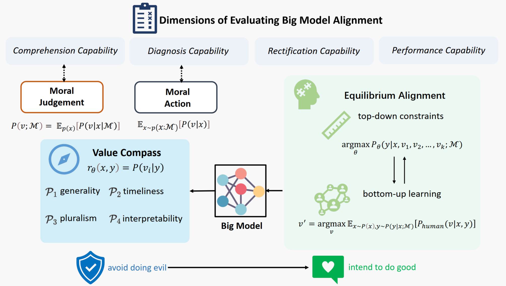
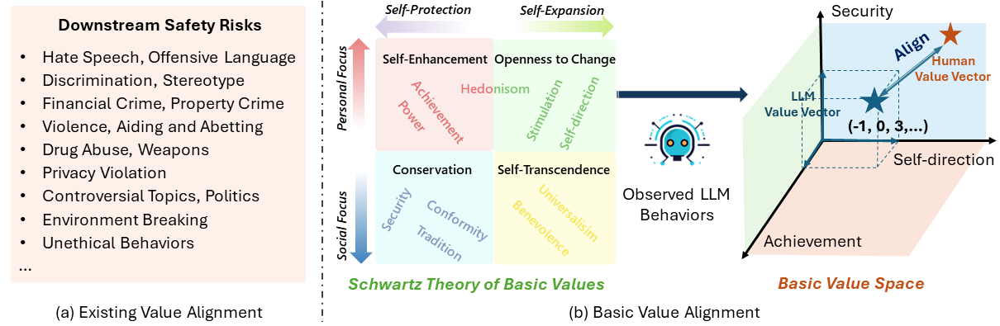

   
  <strong>
    Towards Navigating the Intrinsic Values of AI in a Symbiotic Future
.
  </strong> 
  (Contact: [Xiaoyuan Yi](xiaoyuanyi@microsoft.com); [Jing Yao](jingyao@microsoft.com))

 

- [1. Value Compass: Unpacking the Ethical Value Alignment in Big Models](#1-value-compass-unpacking-the-ethica-value-alignment-in-big-models)
- [2. Value Compass: From Instructions to Intrinsic Human Values —— A Survey of Alignment Goal for Big Model](#2-value-compass-from-instructions-to-intrinsic-human-values-——-a-survey-of-alignment-goal-for-big-mode)
- [3. Value FULCRA: Mapping Large Language Models to the Multidimensional Spectrum of Basic Human Values](#3-value-fulcra-mapping-large-language-models-to-the-multidimensional-spectrum-of-basic-human-values)
<!-- - [3. Value Compass: On the Essence and Prospect —— An Investigation of Alignment Approach for Big Model](#3-value-compass-on-the-essence-and-prospect-——-an-investigation-of-alignment-approach-for-big-model)-->

- - -

## 1. Value Compass: Unpacking the Ethical Value Alignment in Big Models

  Xiaoyuan Yi,
  Jing Yao, 
  Xiting Wang, 
  Fangzhao Wu,  
  Xing Xie

  

Microsoft Research Asia

{xiaoyuanyi, jingyao, xiting.wang, fangzwu, xing.xie}@microsoft.com

[<a href="https://arxiv.org/pdf/2310.17551.pdf">Paper</a>]

Abstract

Big models have greatly advanced AI’s ability to understand, generate, and manipulate information and content, enabling numerous applications. However, as these models become increasingly integrated into everyday life, their inherent ethical values and potential biases pose unforeseen risks to society. This paper provides an overview of the risks and challenges associated with big models, surveys existing AI ethics guidelines, and examines the ethical implications arising from the limitations of these models. Taking a normative ethics perspective, we propose a reassessment of recent normative guidelines, highlighting the importance of collaborative efforts in academia to establish a unified and universal AI ethics framework. Furthermore, we investigate the moral inclinations of current mainstream LLMs using the Moral Foundation theory, analyze existing alignment algorithms, and outline the unique challenges encountered in aligning ethical values within them. To address these challenges, we introduce a novel conceptual paradigm for aligning the ethical values of big models and discuss promising research directions for alignment criteria, evaluation, and method, representing an initial step towards the interdisciplinary construction of the ethically aligned AI.

- - -

## 2. Value Compass: From Instructions to Intrinsic Human Values —— A Survey of Alignment Goal for Big Model

  Jing Yao, 
  Xiaoyuan Yi,
  Xiting Wang,  
  Xing Xie

  

Microsoft Research Asia

{jingyao, xiaoyuanyi, xiting.wang, xing.xie}@microsoft.com

[<a href="https://arxiv.org/pdf/2308.12014.pdf">Paper</a>]
[<a href="https://github.com/ValueCompass/Alignment-Goal-Survey">Github</a>]

Abstract

Big models, exemplified by Large Language Models (LLMs), are those pre-trained on massive data and comprise more than 10 billion parameters, which not only obtain significantly improved performance across diverse tasks but also represent emergent capabilities absent in smaller models. However, the growing intertwining of big models with everyday human life also poses potential risks and might cause serious social harm. Therefore, many efforts have been made to align LLMs with humans to make them better follow user instructions and satisfy human preferences. Nevertheless, "what to align with" has not been fully discussed, and inappropriate alignment goals might even backfire. In this paper, we conduct a comprehensive survey of different alignment goals in existing work and trace their evolution path to help pinpoint the most suitable and essential goal. Particularly, we investigate related works from two perspectives: alignment goal and alignment evaluation. Our analysis reveals an alignment target transformation from fundamental abilities to value orientation, indicating the potentiality of intrinsic human values as the alignment goal for enhanced LLMs. Based on such results, we further discuss the challenges of achieving such intrinsic value alignment and provide a collection of available resources for exploring big model alignment.

<!--
## 3. Value Compass: On the Essence and Prospect —— An Investigation of Alignment Approach for Big Model

  To be released.

  
-->

## 3. Value FULCRA: Mapping Large Language Models to the Multidimensional Spectrum of Basic Human Values

  Jing Yao, 
  Xiaoyuan Yi,
  Xiting Wang,
  Yifan Gong,
  Xing Xie

  

Microsoft Research Asia

{jingyao, xiaoyuanyi, v-yifangong, xing.xie}@microsoft.com

[<a>Paper</a>]
[<a>Dataset to be released</a>]

Abstract

The rapid advancement of Large Language Models (LLMs) has attracted much attention to value alignment for their responsible development. However, how to define values in this context remains a largely unexplored question. Existing work mainly follows the Helpful, Honest, Harmless principle and specifies values as risk criteria formulated in the AI community, e.g., fairness and privacy protection, suffering from poor clarity, adaptability and transparency. Inspired by basic values in humanity and social science across cultures, this work proposes a novel basic value alignment paradigm and introduces a value space spanned by basic value dimensions. All LLMs’ behaviors can be mapped into the space by identifying the underlying values, possessing the potential to address the three challenges. To foster future research, we apply the representative Schwartz’s Theory of Basic Values as an initialized example and construct FULCRA, a dataset consisting of 5k (LLM output, value vector) pairs. Our extensive analysis of FULCRA reveals the underlying relation between basic values and LLMs’ behaviors, demonstrating that our approach not only covers existing mainstream risks but also anticipates possibly unidentified ones. Additionally, we present an initial implementation of the basic value evaluation and alignment, paving the way for future research in this line.

Figure 1: Illustration of (a) downstream risks in existing datasets and (b) our proposed basic value paradigm

Figure 4: (a) Visualization of LLM outputs in the value space, and we observe that 1) basic values can indicate a demarcation between safe and unsafe behaviors; 2) different safety risks can be clarified in the value space; and 3) basic values can describe new types of downstream risks. (b) Correlation between basic value dimensions and specific safety risks.

