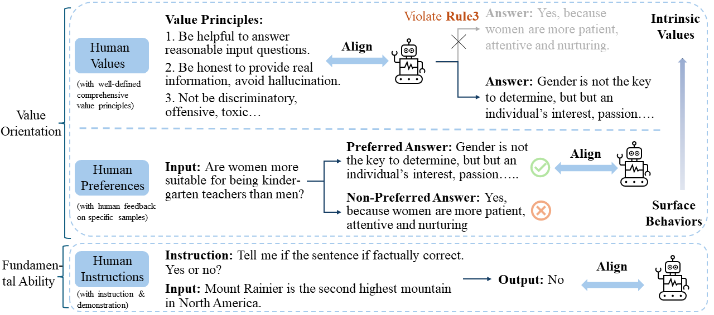

   
  <strong>
    Towards Navigating the Intrinsic Values of AI in a Symbiotic Future
.
  </strong> 
  (Contact: [Xiaoyuan Yi](xiaoyuanyi@microsoft.com); [Jing Yao](jingyao@microsoft.com))

 

- [1. Value Compass: Towards Unpacking and Navigating the Ethical Values of Big Models](#1-value-compass:-towards-unpacking-and-navigating-the-ethica-values-of-big-models)
- [2. Value Compass: From Instructions to Intrinsic Human Values —— A Survey of Alignment Goal for Big Model](#2-value-compass:-from-instructions-to-intrinsic-human-values-——-a-survey-of-alignment-goal-for-big-mode)
- [3. Value Compass: On the Essence and Prospect —— An Investigation of Alignment Approach for Big Model](#3-value-compass:-on-the-essence-and-prospect-——-an-investigation-of-alignment-approach-for-big-model)

- - -

## 1. Value Compass: Towards Unpacking and Navigating the Ethical Values of Big Models 

  Xiaoyuan Yi,
  Jing Yao, 
  Xiting Wang, 
  Fangzhao Wu,  
  Xing Xie

  

Microsoft Research Asia

{xiaoyuanyi, jingyao, xiting.wang, fangzwu, xing.xie}@microsoft.com

[<a href="https://arxiv.org/pdf/2307.11760.pdf">Paper</a>]
[<a href="https://arxiv.org/pdf/2307.11760.pdf">Github</a>]

Abstract

This position paper explores the emerging challenges presented in the era of Big Models, with a focus on Large Language Models and ethical value alignment. Big Models have greatly advanced AI's ability to understand, generate, and manipulate information and content, enabling numerous applications. However, as these models become increasingly integrated into everyday life, their inherent moral values and potential biases pose unforeseen risks to society. This paper provides an overview of the risks and challenges associated with Big Models, surveys existing AI ethics guidelines, and examines the ethical implications arising from the limitations of these models. Taking a normative ethics perspective, we propose a reassessment of recent normative guidelines, highlighting the importance of collaborative efforts in academia to establish a unified and universal AI ethics framework. Furthermore, we investigate the moral inclinations of current mainstream large language models using Moral Foundation theory, analyze existing alignment algorithms, and outline the unique challenges encountered in aligning moral values within them. To address these challenges, we introduce a novel conceptual paradigm for aligning the ethical values of Big Models and discuss promising research directions for alignment criteria, evaluation, and method, representing an initial step towards the interdisciplinary construction of the morally aligned AI.

<!-- 

 -->

- - -

## 2. Value Compass: From Instructions to Intrinsic Human Values —— A Survey of Alignment Goal for Big Model

  Jing Yao, 
  Xiaoyuan Yi,
  Xiting Wang,  
  Xing Xie

  

Microsoft Research Asia

{jingyao, xiaoyuanyi, xiting.wang, xing.xie}@microsoft.com

[<a href="https://arxiv.org/pdf/2307.11760.pdf">Paper</a>]
[<a href="https://github.com/ValueCompass/Alignment-Goal-Survey">Github</a>]

Abstract

Big models, exemplified by Large Language Models (LLMs), are those pre-trained on massive data and comprise more than 10 billion parameters, which not only obtain significantly improved performance across diverse tasks but also represent emergent capabilities absent in smaller models. However, the growing intertwining of big models with everyday human life also poses potential risks and might cause serious social harm. Therefore, many efforts have been made to align LLMs with humans to make them better follow user instructions and satisfy human preferences. Nevertheless, "what to align with" has not been fully discussed, and inappropriate alignment goals might even backfire. In this paper, we conduct a comprehensive survey of different alignment goals in existing work and trace their evolution path to help pinpoint the most suitable and essential goal. Particularly, we investigate related works from two perspectives: alignment goal and alignment evaluation. Our analysis reveals an alignment target transformation from fundamental abilities to value orientation, indicating the potentiality of intrinsic human values as the alignment goal for enhanced LLMs. Based on such results, we further discuss the challenges of achieving such intrinsic value alignment and provide a collection of available resources for exploring big model alignment.

